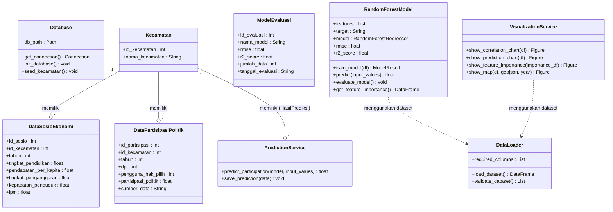

# Class Diagram Konseptual Sistem

Class diagram konseptual menggambarkan struktur internal kelas atau modul program Python yang menyusun sistem beserta relasi antar-kelas tersebut.

---

## 1. Class Diagram (Mermaid)

---

## 2. Deskripsi Kelas
1. **Database**: Kelas penanggung jawab yang mengatur siklus basis data SQLite mulai dari inisialisasi, seeding awal data master, dan penyediaan objek koneksi.
2. **DataLoader**: Kelas pembaca dan pembersih data yang bertanggung jawab menyuplai dataframe masukan untuk analisis dan pemodelan.
3. **Kecamatan, DataSosioEkonomi, DataPartisipasiPolitik, ModelEvaluasi**: Representasi entitas data/model domain dari tabel basis data.
4. **RandomForestModel**: Kelas representasi logis algoritma Random Forest untuk pelatihan model, penghitungan metrik akurasi (RMSE, R²), dan ekstraksi pentingnya fitur (*feature importance*).
5. **PredictionService**: Penghubung antara input antarmuka pengguna dengan model terlatih untuk mengeksekusi prediksi tingkat partisipasi politik dan menyimpan log riwayat ke database.
6. **VisualizationService**: Penyedia grafik plotly dan peta choropleth dari data yang disediakan oleh DataLoader.
