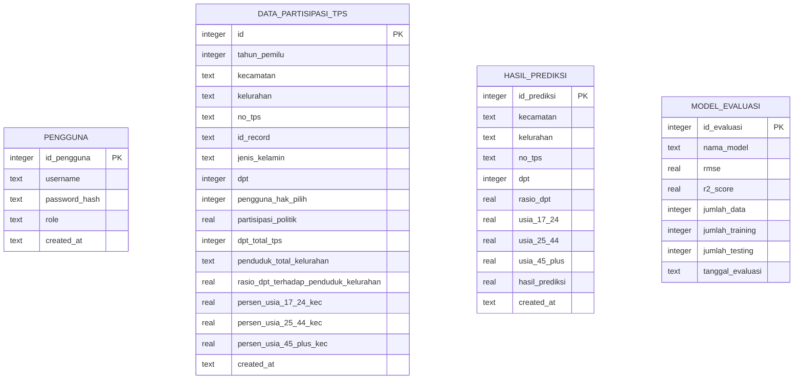

# Entity Relationship Diagram (ERD) - SQLite

Diagram di bawah ini menggambarkan struktur entitas tabel dan relasi logika data di dalam database `polpart.db` setelah penyesuaian level TPS dan penambahan autentikasi peran (*role*).

### Penjelasan Relasi:
* **`PENGGUNA`**: Berdiri sendiri sebagai entitas pengelola sistem. Akun dengan `role = 'admin'` memiliki hak akses istimewa untuk mengunggah dan melakukan pembaruan massal (*bulk upsert*) pada tabel `DATA_PARTISIPASI_TPS`.
* **`DATA_PARTISIPASI_TPS`**: Menyimpan baris data riil pemilu tingkat TPS. Data dari tabel ini diproyeksikan langsung ke VIEW `dataset_final` untuk melatih algoritma *Random Forest Regressor*.
* **`HASIL_PREDIKSI`**: Menjadi log riwayat transaksi prediksi yang dilakukan baik oleh `Admin` maupun `User`.
* **`MODEL_EVALUASI`**: Menampung log evaluasi statistik performa model (*RMSE* dan *R² Score*) hasil training secara berkala.
