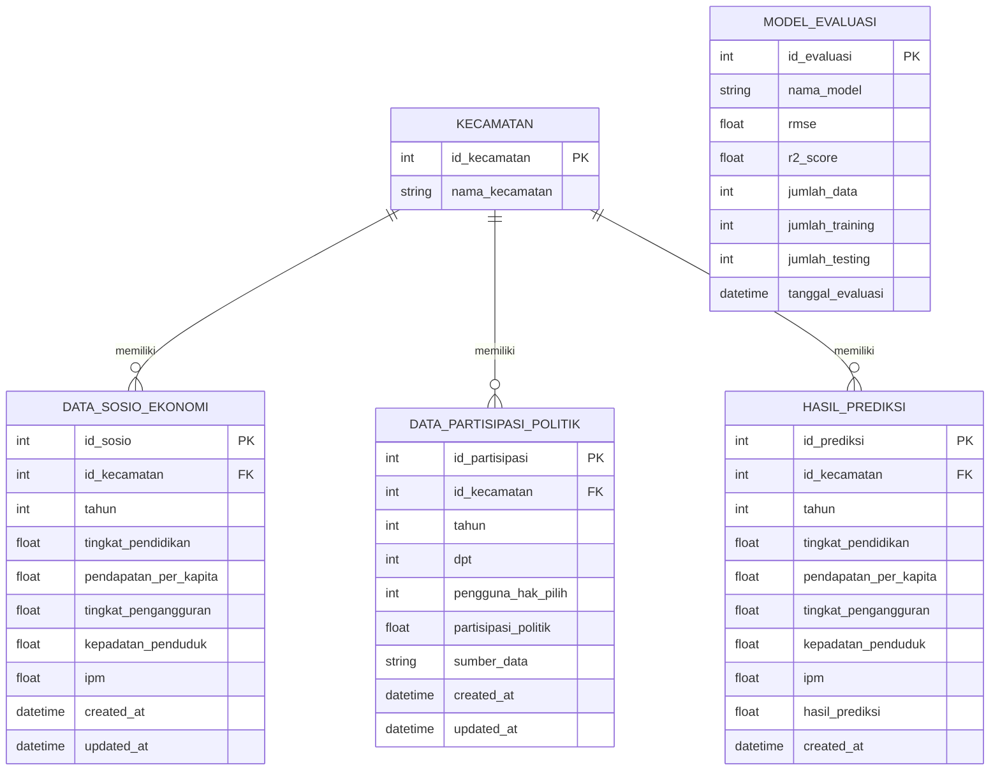

# Entity Relationship Diagram (ERD) Database

Entity Relationship Diagram (ERD) menggambarkan hubungan logika antar-tabel dalam database SQLite. Tabel `kecamatan` menjadi master data yang direlasikan dengan data sosial ekonomi, data partisipasi politik, dan hasil prediksi.

---

## 1. Diagram ERD (Mermaid)

---

## 2. Penjelasan Relasi ERD
1. **KECAMATAN ke DATA_SOSIO_EKONOMI (One-to-Many)**: Satu kecamatan dapat memiliki banyak data sosio-ekonomi dari tahun yang berbeda. Setiap baris di `DATA_SOSIO_EKONOMI` wajib merujuk pada satu `id_kecamatan` yang valid.
2. **KECAMATAN ke DATA_PARTISIPASI_POLITIK (One-to-Many)**: Satu kecamatan memiliki banyak data partisipasi pemilu dari tahun ke tahun. Kolom `id_kecamatan` menjadi kunci tamu (*foreign key*) yang menghubungkan data.
3. **KECAMATAN ke HASIL_PREDIKSI (One-to-Many, Opsional)**: Satu kecamatan dapat memiliki banyak log riwayat prediksi. Relasi ini bersifat opsional (`id_kecamatan` boleh bernilai kosong/NULL apabila pengguna melakukan prediksi tanpa memilih kecamatan tertentu).
4. **MODEL_EVALUASI (Berdiri Sendiri / Standalone)**: Tabel ini tidak memiliki hubungan langsung (*foreign key*) dengan tabel kecamatan, karena menyimpan log evaluasi model Random Forest yang dilatih secara agregat menggunakan seluruh data dari VIEW gabungan.
