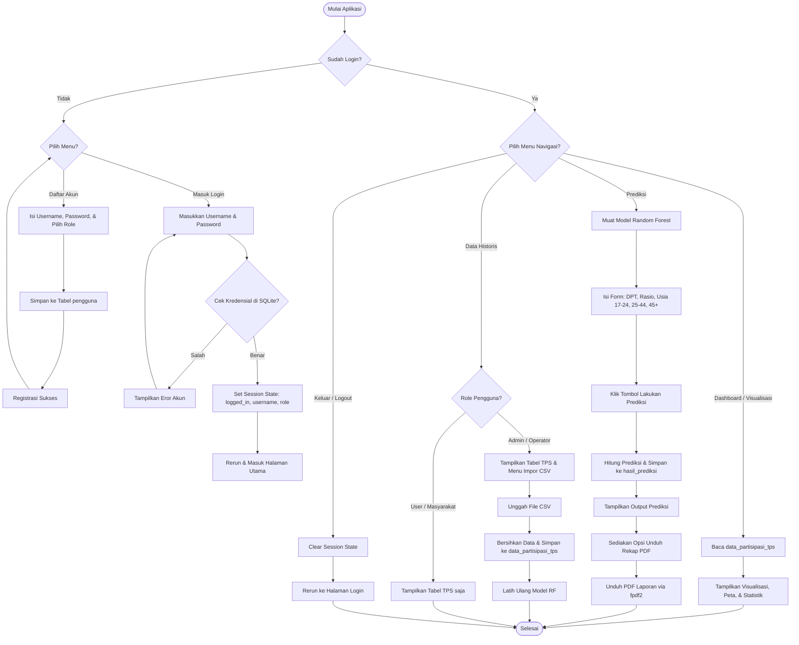

# Flowchart Alur Sistem (PolPart RF)

Berikut adalah diagram alir (*flowchart*) logika bisnis aplikasi PolPart RF yang menggambarkan proses registrasi, autentikasi login, pemeriksaan hak akses, pemrosesan prediksi, serta pembuatan laporan PDF.

---

## 1. Diagram Alir Sistem (Mermaid format)

---

## 2. Penjelasan Alur Proses

### A. Alur Autentikasi (Registrasi & Login)
1. Aplikasi dimulai dengan memeriksa status session `logged_in`. Jika tidak aktif, pengguna dipaksa masuk ke halaman **Login / Register**.
2. Pengguna baru dapat mendaftar dengan menentukan username dan password, serta memilih perannya (*Admin* atau *User*).
## 2. Penjelasan Alur Logika Per Fitur

Berikut adalah rincian alur logika (*flowchart*) yang berjalan di belakang layar untuk masing-masing fitur utama sistem:

### A. Fitur Registrasi Akun Baru (Register)
1. **Input Data**: Pengguna memasukkan data pada form registrasi yang terdiri dari *Username Baru*, *Password Baru*, dan *Konfirmasi Password*.
2. **Validasi Kosong**: Sistem memeriksa apakah Username atau Password dalam keadaan kosong. Jika kosong, sistem menampilkan pesan eror.
3. **Validasi Konfirmasi Password**: Sistem mencocokkan apakah *Password Baru* dan *Konfirmasi Password* memiliki nilai yang sama. Jika tidak cocok, sistem menampilkan pesan eror.
4. **Enkripsi Kredensial**: Jika semua input valid, sistem meng-hash password menggunakan algoritma **SHA-256** secara satu arah.
5. **Penyimpanan Database**: Sistem melakukan operasi `INSERT` ke tabel `pengguna` di database SQLite dengan status peran (*role*) otomatis di-hardcode sebagai **`user` (Masyarakat)** demi keamanan.
6. **Selesai**: Jika username belum digunakan, registrasi sukses dan pengguna diarahkan ke tab Login.

---

### B. Fitur Masuk Sistem (Login)
1. **Input Data**: Pengguna memasukkan *Username* dan *Password* pada form masuk.
2. **Enkripsi Input**: Sistem mengambil password input dan meng-hash nilainya menggunakan SHA-256.
3. **Pencocokan Database**: Sistem menjalankan query SELECT ke tabel `pengguna` untuk mencari kecocokan *Username* dan *Password Hash*.
4. **Verifikasi Hasil**:
   - Jika **Tidak Cocok**: Sistem menampilkan pesan kesalahan akun salah dan mengulang form input.
   - Jika **Cocok**: Sistem mengaktifkan variabel `st.session_state["logged_in"] = True`, serta menyimpan data `username` dan `role` (Admin/User) ke dalam session state memori RAM server.
5. **Rerun & Masuk**: Sistem memicu fungsi `st.rerun()` untuk memuat ulang aplikasi web dan membuka akses halaman utama.

---

### C. Fitur Dashboard Analitik
1. **Load Data**: Halaman dashboard memanggil fungsi `load_data_from_sidebar()`.
2. **Pengecekan Database**: Jika database kosong, aplikasi berhenti dan memunculkan peringatan. Jika terisi, database memuat data TPS.
3. **Perhitungan Ringkasan (get_summary)**: Sistem menyaring data dan menghitung:
   - Total jumlah baris data TPS.
   - Nilai rata-rata persentase partisipasi politik.
   - Nilai partisipasi tertinggi (mencari kelurahan dan nomor TPS terkait).
   - Nilai partisipasi terendah (mencari kelurahan dan nomor TPS terkait).
4. **Render Visual**: Hasil perhitungan ditampilkan menggunakan modul HTML kustom (`custom_metric_card`) dengan warna mint dan coral bebas emoji.

---

### D. Fitur Data Historis (Tabel TPS)
1. **Saring Filter (sidebar_filters)**: Sistem memuat pilihan filter tahun dan kecamatan di sidebar.
2. **Pemrosesan Filter (filter_dataset)**: Tabel data TPS difilter secara dinamis berdasarkan tahun dan kecamatan yang dicentang.
3. **Pencarian Kata Kunci (Search Bar)**: Pengguna mengetik kata kunci. Sistem memfilter baris data yang mengandung kata kunci tersebut pada kolom *kecamatan*, *kelurahan*, atau *nomor TPS*.
4. **Render Grid**: Data yang telah disaring ditampilkan dalam bentuk tabel interaktif menggunakan fungsi `rename_for_display` untuk merapikan nama kolom.
5. **Ekspor CSV**: Pengguna dapat menekan tombol download untuk mengunduh seluruh data yang sedang tampil di tabel menjadi berkas `.csv`.

---

### E. Fitur Impor Data Baru via CSV (Hanya Admin)
1. **Pengecekan Akses**: Sistem memeriksa `st.session_state["role"]`. Jika nilainya bukan `'admin'`, widget uploader disembunyikan.
2. **Unggah File**: Admin mengunggah berkas `.csv` data TPS.
3. **Validasi Struktur Kolom**: Sistem memeriksa apakah kolom wajib (`tahun_pemilu`, `kecamatan`, `kelurahan`, `no_tps`, `partisipasi_politik`) ada di berkas. Jika tidak ada, impor digagalkan.
4. **Operasi Database (Clear & Insert)**:
   - Sistem melakukan query `DELETE FROM data_partisipasi_tps` untuk membersihkan data lama guna mencegah duplikasi.
   - Sistem melakukan perulangan (*looping*) baris demi baris, membersihkan tipe data, dan melakukan query `INSERT` massal ke tabel database SQLite.
5. **Auto-Retrain Model**: Setelah commit database sukses, sistem secara otomatis melatih ulang (*retraining*) model Random Forest menggunakan data baru tersebut dan menyimpan otak model (.joblib) yang baru.
6. **Selesai**: Halaman di-refresh otomatis untuk menampilkan data ter-update.

---

### F. Fitur Simulasi Prediksi Random Forest
1. **Inisialisasi Model**: Halaman memanggil fungsi `train_random_forest(df)` untuk melatih model regresi Random Forest secara instan di latar belakang.
2. **Form Input Variabel**: Pengguna memasukkan 5 nilai parameter demografi (DPT, Rasio DPT Kelurahan, % Usia 17-24, % Usia 25-44, % Usia 45+) serta lokasi (Kecamatan, Kelurahan, No TPS).
3. **Kalkulasi Prediksi**: Model Random Forest memproses 5 input demografis tersebut menggunakan algoritma regresi pohon keputusan dan menghasilkan angka estimasi persentase partisipasi.
4. **Penyimpanan Log**: Sistem menyimpan log input parameter beserta hasil prediksi ke tabel `hasil_prediksi`.
5. **Render Output**: Hasil prediksi ditampilkan di layar dalam bentuk kartu orange besar dengan visual tebal.

---

### G. Fitur Ekspor Rekap Laporan PDF
1. **Pengumpulan Data**: Sistem mengumpulkan parameter masukan simulasi, nilai output prediksi, serta metrik akurasi model (RMSE & R² Score).
2. **Pembuatan Dokumen**: Sistem memicu fungsi `generate_recap_pdf` dari modul `src/pdf_generator.py`.
3. **Penyusunan Desain**:
   - Menambahkan header banner formal berwarna mint-coral.
   - Menyusun metadata (waktu cetak, nama akun pencetak, dan lokasi wilayah).
   - Menggambar tabel parameter input demografi dengan border abu-abu tipis (`#e2e8f0`).
   - Menyisipkan kotak visual hasil prediksi model berwarna peach.
   - Menambahkan detail performa statistik model Random Forest (RMSE & R²).
4. **Mengirim Bytes**: Berkas PDF diubah menjadi byte stream memori.
5. **Unduh Berkas**: Browser mengunduh berkas rekapitulasi PDF tersebut secara langsung ke komputer pengguna.

---

### H. Fitur Visualisasi & Peta Spasial Choropleth
1. **Heatmap Korelasi**: Menghitung korelasi Pearson antar variabel demografi dan menampilkan visualisasi matriks warna Plotly.
2. **Grafik Batang & Garis**: Menggambar rata-rata partisipasi per kecamatan dan grafik garis tren kenaikan partisipasi tahunan.
3. **Peta Spasial (Choropleth Map)**:
   - Sistem memuat berkas koordinat wilayah `kecamatan_5.geojson`.
   - Mengelompokkan data TPS (`groupby`) berdasarkan nama kecamatan untuk menghitung rata-rata partisipasinya.
   - Mengubah teks nama kecamatan menjadi Title Case (contoh: `BANJARMASIN BARAT` ➔ `Banjarmasin Barat`) agar cocok dengan properti `WADMKC` di file GeoJSON.
   - Plotly merender peta geospasial berwarna gradasi secara interaktif.

---

### I. Fitur Keluar Sistem (Logout)
1. **Klik Tombol**: Pengguna mengklik tombol "Keluar (Logout)" di bagian bawah sidebar.
2. **Pembersihan Session**: Sistem menghapus status login dengan menyetel `st.session_state["logged_in"] = False`, serta mengosongkan username dan role.
3. **Redirect**: Sistem memanggil `st.rerun()`, sehingga secara otomatis mengunci kembali aplikasi dan mengarahkan pengguna ke halaman Login.
