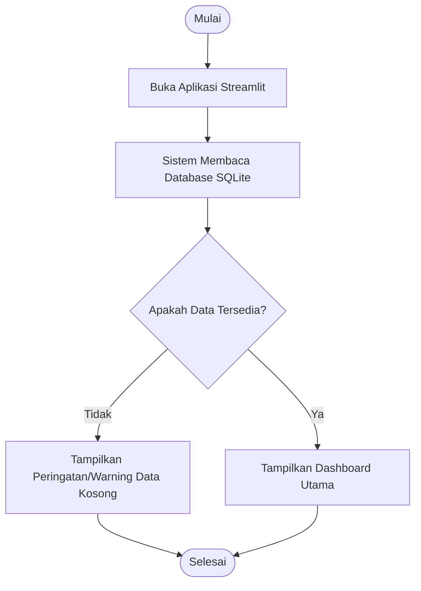
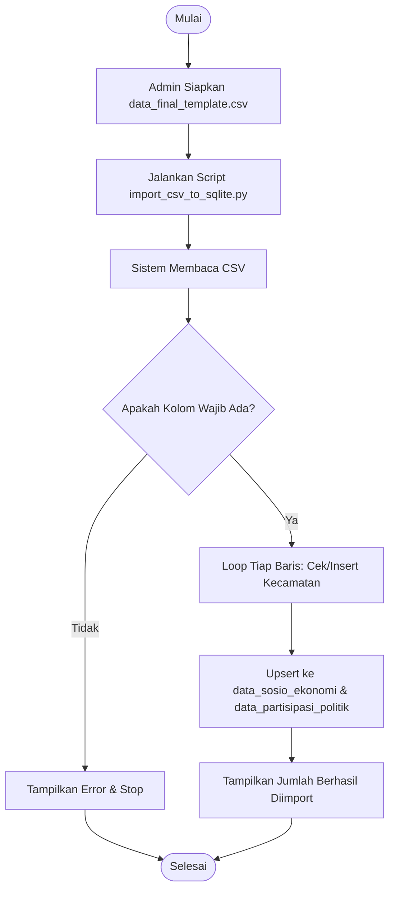
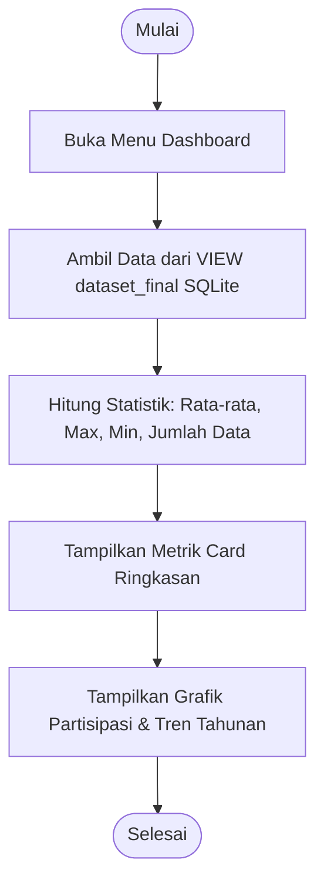
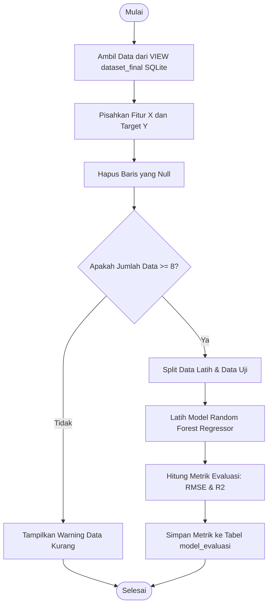
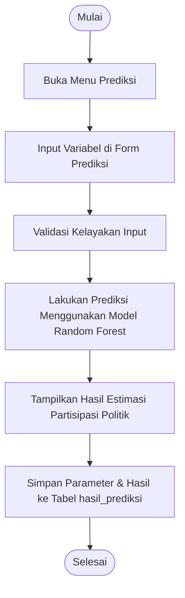
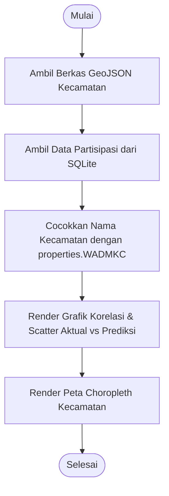

# Flowchart Sistem: Analisis Alur Proses

Berikut adalah rancangan flowchart proses sistem dalam bentuk teks deskripsi dan diagram alir menggunakan **Mermaid**:

---

## 1. Flowchart Pengolahan Dataset
Menggambarkan alur pembacaan dataset oleh aplikasi saat pertama kali dijalankan.

### Deskripsi Alur:
1. Mulai.
2. Buka aplikasi Streamlit.
3. Sistem membaca data dari database SQLite melalui VIEW `dataset_final`.
4. Sistem memvalidasi ketersediaan data.
5. Jika data kosong (tidak ada data kecamatan terdaftar atau tidak ada baris data), tampilkan warning di layar Streamlit.
6. Jika data tersedia, tampilkan Dashboard.
7. Selesai.

### Diagram Mermaid:

---

## 2. Flowchart Import Data
Menggambarkan alur pengunggahan data dari berkas CSV awal ke dalam basis data SQLite melalui terminal.

### Deskripsi Alur:
1. Mulai.
2. Admin menyiapkan berkas CSV di path `data/import/data_final_template.csv`.
3. Jalankan skrip import (`python scripts/import_csv_to_sqlite.py`).
4. Sistem membaca file CSV.
5. Validasi ketersediaan kolom wajib (`tahun` dan `kecamatan`).
6. Cek apakah nama kecamatan pada baris CSV terdaftar di tabel `kecamatan`. Jika tidak, masukkan kecamatan tersebut ke database.
7. Simpan/perbarui (upsert) data sosio-ekonomi ke tabel `data_sosio_ekonomi` dan data partisipasi ke tabel `data_partisipasi_politik`.
8. Selesai.

### Diagram Mermaid:

---

## 3. Flowchart Dashboard
Menggambarkan alur penyajian halaman ringkasan data dan grafik statistik.

### Deskripsi Alur:
1. Mulai.
2. Buka menu Dashboard.
3. Ambil data dari VIEW `dataset_final` di SQLite.
4. Hitung ringkasan statistik (jumlah baris, rata-rata, nilai tertinggi, dan terendah).
5. Tampilkan metrik ringkasan, grafik batang partisipasi per kecamatan, dan grafik garis tren tahunan.
6. Selesai.

### Diagram Mermaid:

---

## 4. Flowchart Training Random Forest
Menggambarkan alur pengolahan dan pelatihan data latih untuk menghasilkan model prediksi.

### Deskripsi Alur:
1. Mulai.
2. Ambil data dari VIEW `dataset_final` SQLite.
3. Pisahkan variabel fitur (X) dan target (Y). Fitur X meliputi: `tingkat_pendidikan`, `pendapatan_per_kapita`, `tingkat_pengangguran`, `kepadatan_penduduk`, `ipm`. Target Y meliputi: `partisipasi_politik`.
4. Bersihkan data (hapus/drop baris yang mengandung nilai kosong/null pada kolom X dan Y).
5. Cek jumlah baris data bersih. Jika kurang dari 8 baris, tampilkan warning ke layar pengguna.
6. Lakukan pembagian data menjadi data latih (train) dan data uji (test).
7. Latih algoritma Random Forest Regressor menggunakan data latih.
8. Uji model ke data uji, hitung metrik performa (RMSE dan R²).
9. Simpan metrik hasil evaluasi ke tabel `model_evaluasi` di database SQLite.
10. Selesai.

### Diagram Mermaid:

---

## 5. Flowchart Prediksi
Menggambarkan alur penggunaan model terlatih untuk memprediksi tingkat partisipasi politik.

### Deskripsi Alur:
1. Mulai.
2. Buka menu Prediksi.
3. Input nilai indikator sosial ekonomi (pendidikan, pendapatan, pengangguran, kepadatan penduduk, IPM) beserta kecamatan dan tahun tujuan (opsional) melalui formulir.
4. Validasi kebenaran input formulir.
5. Model Random Forest yang telah dilatih memprediksi persentase partisipasi politik.
6. Tampilkan estimasi persentase partisipasi politik di layar.
7. Simpan detail masukan dan hasil prediksi ke tabel `hasil_prediksi` di database SQLite.
8. Selesai.

### Diagram Mermaid:

---

## 6. Flowchart Visualisasi dan Peta
Menggambarkan alur pembacaan data geografis (GeoJSON) dan data statistik untuk dipetakan.

### Deskripsi Alur:
1. Mulai.
2. Ambil data spasial dari file `kecamatan_5.geojson`.
3. Ambil data partisipasi politik dari VIEW `dataset_final` SQLite.
4. Lakukan pencocokan (matching) data berdasarkan nama kecamatan dengan properti `properties.WADMKC` pada file GeoJSON.
5. Tampilkan grafik korelasi (heatmap), grafik perbandingan aktual vs prediksi, dan peta choropleth kecamatan Banjarmasin.
6. Selesai.

### Diagram Mermaid:

