# Use Case Diagram: Interaksi Aktor dengan Sistem

## 1. Deskripsi Narasi
Use case diagram menggambarkan interaksi pengguna dengan sistem prediksi partisipasi politik. Pengguna dapat mengelola data melalui proses import, melihat dashboard, menjalankan prediksi, melihat evaluasi model, dan menampilkan visualisasi data.

Sistem ini didesain dalam bentuk aplikasi mandiri di mana pengguna dapat mengoperasikan seluruh fitur analisis dan prediksi.

---

## 2. Definisi Aktor
Sistem ini berinteraksi dengan satu aktor utama:
- **Pengguna**: Aktor yang mengoperasikan sistem mulai dari mengimpor data awal, mengelola basis data, melihat dashboard statistik, melatih model, melakukan prediksi tingkat partisipasi politik, dan meninjau visualisasi geografis.

---

## 3. Daftar Use Case
Berikut adalah fungsionalitas (use case) yang tersedia bagi aktor:
1. **Membuka Aplikasi**: Mengakses alamat web server Streamlit lokal.
2. **Melihat Dashboard**: Membaca ringkasan data, metrik performa, dan bagan utama.
3. **Import Data CSV ke SQLite**: Menjalankan skrip impor terminal untuk memindahkan data mentah ke database terstruktur.
4. **Melihat Data Historis**: Menampilkan tabel data yang bersumber langsung dari database SQLite.
5. **Filter Data Historis**: Melakukan pemfilteran data historis berdasarkan tahun dan nama kecamatan.
6. **Melatih Model Random Forest**: Sistem memicu pelatihan ulang model Random Forest saat memuat data.
7. **Melihat Evaluasi Model**: Meninjau skor performa model (RMSE & R²).
8. **Input Variabel Prediksi**: Memasukkan indikator sosio-ekonomi ke form prediksi.
9. **Melihat Hasil Prediksi**: Meninjau output estimasi persentase partisipasi politik.
10. **Melihat Feature Importance**: Meninjau kontribusi tiap variabel terhadap prediksi model.
11. **Melihat Visualisasi Korelasi**: Membaca grafik korelasi (heatmap) antar-variabel.
12. **Melihat Peta Kecamatan**: Meninjau peta choropleth visualisasi tingkat partisipasi.
13. **Melihat Halaman Tentang**: Membaca panduan dan penjelasan metodologi aplikasi.

---

## 4. Diagram Use Case (Mermaid)
Berikut adalah visualisasi Use Case Diagram menggunakan notasi Mermaid:

```mermaid
graph TD
    %% Define Actor
    Pengguna([Pengguna])

    subgraph Sistem Prediksi Partisipasi Politik
        UC1[Membuka Aplikasi]
        UC2[Melihat Dashboard]
        UC3[Import Data CSV ke SQLite]
        UC4[Melihat Data Historis]
        UC5[Filter Data Historis]
        UC6[Melatih Model Random Forest]
        UC7[Melihat Evaluasi Model]
        UC8[Input Variabel Prediksi]
        UC9[Melihat Hasil Prediksi]
        UC10[Melihat Feature Importance]
        UC11[Melihat Visualisasi Korelasi]
        UC12[Melihat Peta Kecamatan]
        UC13[Melihat Halaman Tentang]
    end

    %% Relate Actor to Use Cases
    Pengguna --> UC1
    Pengguna --> UC2
    Pengguna --> UC3
    Pengguna --> UC4
    Pengguna --> UC5
    Pengguna --> UC6
    Pengguna --> UC7
    Pengguna --> UC8
    Pengguna --> UC9
    Pengguna --> UC10
    Pengguna --> UC11
    Pengguna --> UC12
    Pengguna --> UC13
```


na --> UC13
```
